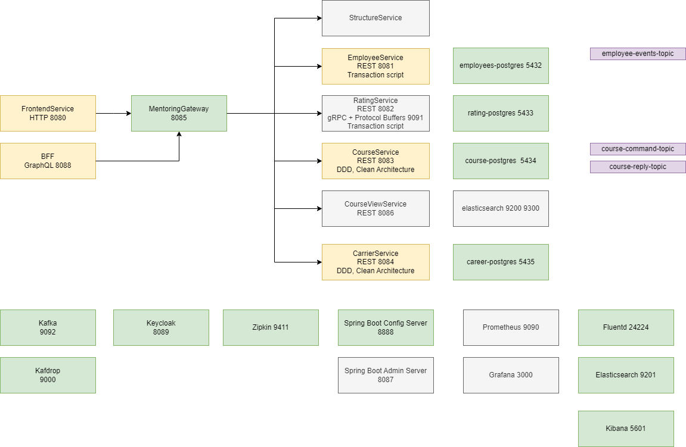

# Spring Cloud tanfolyam

## Felhasznált irodalom

Chris Richardson: Microservices Patterns, https://microservices.io/patterns/microservices.html
Vaughn Vernon: Domain-Driven Design Distilled

## Ajánlott irodalom

Microservices with Spring Boot and Spring Cloud: Build resilient and scalable microservices using Spring Cloud, Istio, and Kubernetes, 2nd Edition 2nd ed. Edition
Building Microservices - Designing Fine-Grained Systems 2nd Edition
Cloud Native Spring in Action
[Release It!: Design and Deploy Production-Ready Software (Pragmatic Programmers)](https://www.amazon.com/Release-Design-Deploy-Production-Ready-Software/dp/1680502395/ref=sr_1_15?keywords=continuous+delivery&qid=1677850778&s=books&sprefix=conti%2Cstripbooks-intl-ship%2C181&sr=1-15)

## Architektúra



## Klónozás

```shell
git clone https://github.com/Training360/javax-spcl-2023-07-24
```

## Saját projekt létrehozása

* `mentoring-app` könyvtár létrehozása
* A klónozott repo-ból az `employee-service` könyvtár átmásolása

## employee-service elindítása

* Docker Desktop indítása
* `docker ps` parancs kiadása

```shell
docker run -d -e POSTGRES_DB=employees -e POSTGRES_USER=employees -e POSTGRES_PASSWORD=employees -p 5432:5432  --name employees-postgres postgres
```

* Projekt megnyitása IDEA-ban
* JDK beállítása
* Alkalmazás indítása az `Application` osztállyal
* A Swagger elérhető a `http://localhost:8081/swagger-ui.html` címen

## course-service kiegészítése és indítása

* `Service` osztály kiegészítése (entitás, repo is)

```shell
docker run -d -e POSTGRES_DB=course -e POSTGRES_USER=course -e POSTGRES_PASSWORD=course -p 5434:5432  --name course-postgres postgres
```

* enrollment

## Spring Cloud Stream Kafka Reactive

```
docker exec -it kafka-kafka-1 kafka-console-producer.sh --bootstrap-server localhost:9092 --topic downloadparseconvertfilter-in-0
```

## CQRS

```shell
docker run -d -e "discovery.type=single-node" -e xpack.security.enabled=false -p 9200:9200 -p 9300:9300 --name elasticsearch elasticsearch:8.6.1
```

## Career service

```shell
docker run -d -e POSTGRES_DB=career -e POSTGRES_USER=career -e POSTGRES_PASSWORD=career -p 5435:5432  --name career-postgres postgres
```

## Keycloak indítása

```shell
docker run -d -e KEYCLOAK_USER=root -e KEYCLOAK_PASSWORD=root -p 8089:8080 --name keycloak jboss/keycloak
```

Keycloak elérés: `http://localhost:8089/`

* Létre kell hozni egy Realm-et (`Mentoring`)
* Létre kell hozni egy klienst, amihez meg kell adni annak azonosítóját, <br /> és hogy milyen url-en érhető el (`employee-service`)
* Létre kell hozni egy klienst, amihez meg kell adni annak azonosítóját, <br /> és hogy milyen url-en érhető el (`frontend-service`)
* Létre kell hozni a szerepköröket (`employee_admin`)
* Létre kell hozni egy felhasználót (a _Email Verified_ legyen _On_ értéken, hogy be lehessen vele jelentkezni), 
  beállítani a jelszavát (a _Temporary_ értéke legyen _Off_, hogy ne kelljen jelszót módosítani), <br /> valamint hozzáadni a szerepkört (`johndoe`)


Client Scopes/roles/Mappers/realm roles/Add to ID token

http://localhost:8089/auth/realms/Mentoring/.well-known/openid-configuration